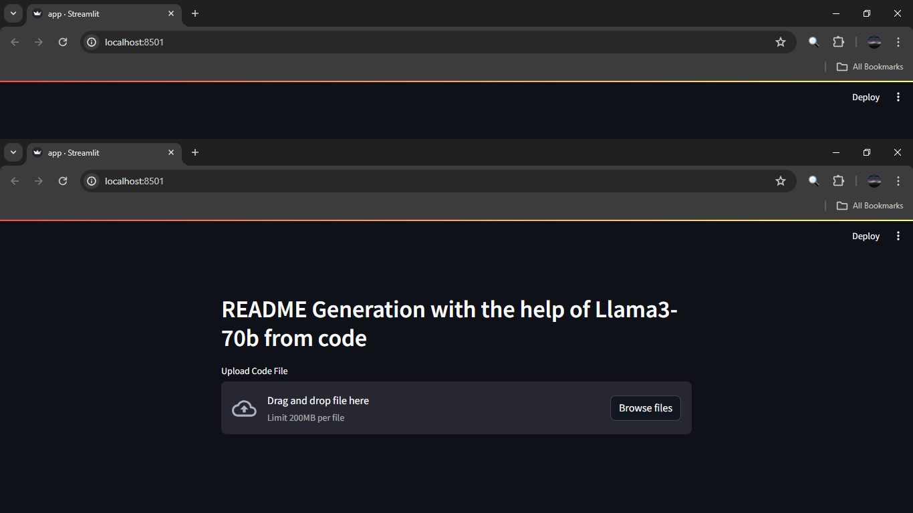
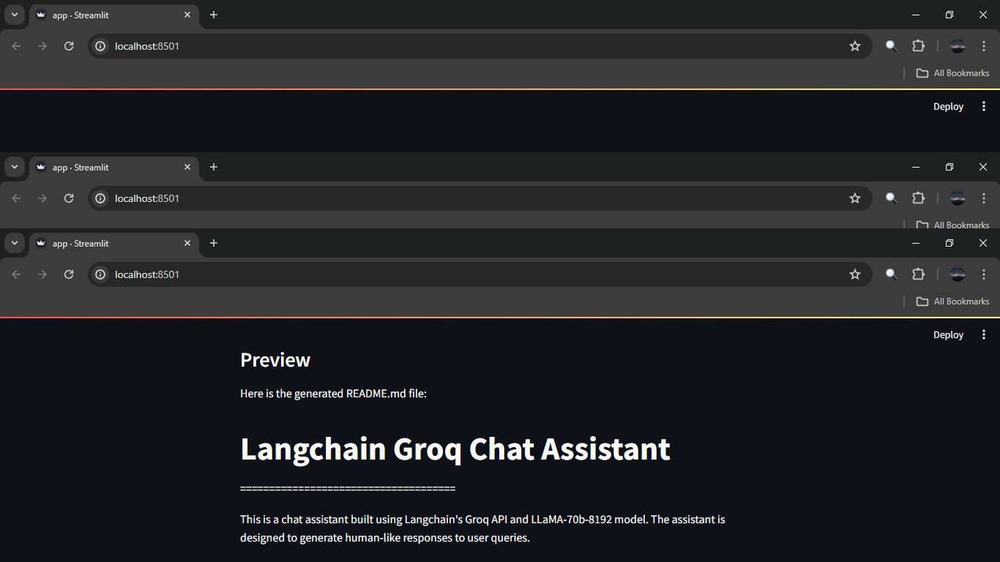

# **README Generation with Llama3-70b** 🚀

## **Introduction** 📚

Welcome to this innovative project, where we harness the power of Llama3-70b to generate README files from code! 💻

## **How it Works** 🤔

1. **Upload Your Code** 💾: Simply upload your code file using the file uploader.
2. **Magic Happens** ✨: Our AI-powered engine, fueled by Llama3-70b, analyzes your code and generates a comprehensive README file.
3. **Preview and Copy** 📝: Review your generated README file and copy it to your clipboard with a single click!

## **Screenshot Demo** 📸

## **Get Started** 🚀

Upload your code file and experience the power of AI-generated README files! 💥
